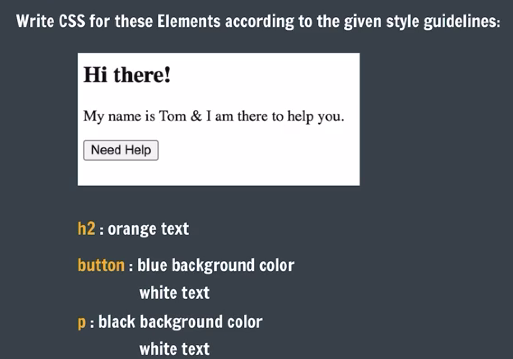
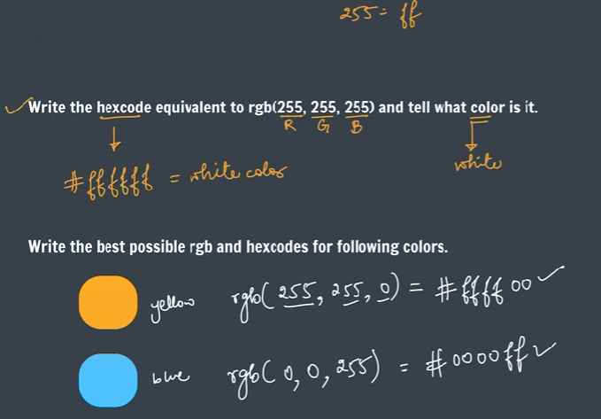

# Practice Questions

- **Qs 1**. <br>
    

- **Qs 2**. <br>
    

- **Qs 3**. <br>
    

- Write CSS for the following code:

    ```html
    <!DOCTYPE html>
    <html lang="en">
        <head>
            <meta charset="UTF-8"/>
            <meta http-equiv="X-UA-Compatible" content="IE=edge"/>
            <meta name="viewport" content="width=device-width, initial-scale=1.0"/>
            <link rel="stylesheet" href="style.css"/>
            <title>Document</title>
        </head>
        <body>
            <!--Poem Name-->
            <h1>Ozymandias</h1>
            <!--Poet's Name-->
            <h3>by Percy Bysshe Shelley</h3>
            <!--Poem-->
            <p>
                I met a traveller from an antique land,<br/>
                Who said—“Two vast and trunkless legs of stone<br/>
                Stand in the desert.... Near them, on the sand,<br/>
                Half sunk a shattered visage lies, whose frown,<br/>
                And wrinkled lip, and sneer of cold command,<br/>
                Tell that its sculptor well those passions read<br/>
                Which yet survive, stamped on these lifeless things,<br/>
                The hand that mocked them, and the heart that fed;<br/>
                And on the pedestal, these words appear:<br/>
                My name is Ozymandias, King of Kings;<br/>
                Look on my Works, ye Mighty, and despair!<br/>
                Nothing beside remains. Round the decay<br/>
                Of that colossal Wreck, boundless and bare<br/>
                The lone and level sands stretch far away.”<br/>
            </p>
            <hr/>
            <h4> Read up  more about the poem on<a href="https://en.wikipedia.org/wiki/Ozymandias">Wikipedia</a>
            </h4>
            <textarea  placeholder="Leave your comment shere..."></textarea>
            <br/><br/>
            <button>Comment</button>
        </body>
    </html>
    ```

    - **Qs 4**. Set the background page to color “wheat”, by using an inline style.

    - **Qs 5**. Change the color of the poem in the page to brown (use the hex code for color).

    - **Qs 6**. Align all the headings & the poem to the center of the poge.

    - **Qs 7**. Change the color of the poem to red & the poet’s name to black.

    - **Qs 8**. Change the font of the entire document to the font-Georgia.

    - **Qs 9**. Set the color of the Wikipedia link to green & remove its underline (use the rgb value for color).

    - **Qs 10**. Change the button background color to white & button text to blueviolet.

    - **Qs 11**. What is the hex code for black color? Set the text area font color to black.

    - **Qs 12**. Set the poem’s line-height to 30px.

    - **Qs 13**. Underline only the word Ozymandias inside the poem.
    