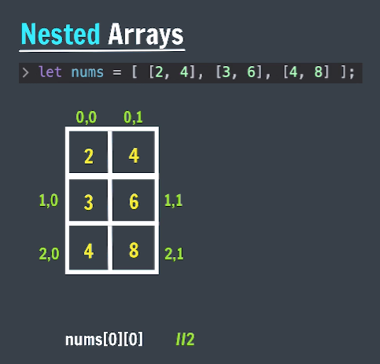

## String Methods
Methods = actions that can be performed on objects.

Format
```js
stringName.method()
```

- **Trim**<br>
    Trims whitespaces from both ends of string & return a new one.

    ```js
    let msg = "  Hello ";
    console.log(msg.trim()); // 'Hello'
    console.log(msg) // '  Hello '

    // output: "Hello", but value of msg remains same.
    ```

- **Strings are Immutable in JS**<br>
    No changes can be made to strings.<br>
    Whenever we do try to make a change, a new string is created and old one remains same.

    ```js
    let msg = "  Hello ";
    console.log(msg.trim()); // 'Hello' (new string created)

    let str = msg.trim();
    console.log(str); // 'Hello'
    console.log(msg); // '  Hello ' — original remains unchanged

    msg = "Hello"; // Now reassigned manually
    console.log(msg); // 'Hello'

    ```
 
- **ToUpperCase and ToLowerCase**

    ```js
    let str = "Random string";

    console.log(str.toUpperCase()); // "RANDOM STRING"
    console.log(str.toLowerCase()); // "random string"
    ```

- **String Methods with Arguments**<br>
    Argument is a some value that we pass to the method.

    Format
    ```js
    stringName.method(arg);
    ```

    - **indexOf**<br>
        Returns the first index of occurrence of some value in string. or gives -1 if not found.

        ```js
        let str = "iloveCoding"

        console.log(str.indexof("love")); // 1
        console.log(str.indexof("J")); // -1 (not found)
        console.log(str.indexof("o")); // 2 (only 1 index)
        ```

    - **slice**<br>
        returns a part of the original string as a new string.

        ```js
        let str = 'ilovecoding';

        console.log(str.slice(5)); // 'coding'
        console.log(str.slice(1, 4)); // 'love'

        str.slice(-num); = str.slice(length-num);
        ```

    - **replace**<br>
        Searches a value in the string & returns a new string with the value replaced.

        ```js
        let str = "ilovecoding";

        console.log(str.replace("love","do")); //"idocoding

        console.log(str.replace("o","x")); // "ilxvecoding"
        ```

    - **repeat**<br>
        returns a string with the number of copies of a string

        ```js
        let str = 'Mango';
        console.log(str.repeat(3)); // "MangoMangoMango"
        ```

- **Method Chaining**<br>
    Using one method after another. order of execution will be left to right.

    ```js
    str.toUpperCase().trim();
    ```

## Array (Data Structure)
Linear collection of things

```js
let students = ["abc", "def", "ghi"]
```

- **Creating Arrays**
    ```js
    let marks = [99, 85, 93, 76, 62];
    let names = ["adam", "bob", "catlyn"];
    let info = ["adam", 25, 6.1]; // mixed array
    let newArr = []; // empty array

    console.log(names[0]); // 'adam'
    console.log(names[0][0]); // 'a'
    console.log(info[0].length) // 4
    ```

- **Arrays are Mutable**
    ```js
    let fruits = ["mango", "apple", "litchi"];

    console.log(fruits[0] = "banana"); // 'banana'

    console.log(fruits); // (3) ['banana', 'apple', 'litchi']

    console.log(fruits[10] = "papaya"); //'papaya'
    
    console.log(fruits); // (11) ['banana', 'apple', 'litchi', empty * 7, 'papaya']
    ```

- **Array Methods**
    - **`Push`**: add to end
    - **`Pop`**: delete from end & return it
    - **`Unshift`**: add to start
    - **`Shift`**: delete from start & return it
        ```js
        let students = ["abc", "def", "ghi"];

        students.push("jkl"); // adds "jkl" at the end
        console.log(students); // ["abc", "def", "ghi", "jkl"]

        students.pop(); // removes last element
        console.log(students); // ["abc", "def", "ghi"]

        students.shift(); // removes first element
        console.log(students); // ["def", "ghi"]

        students.unshift("xyz"); // adds "xyz" at the beginning
        console.log(students); // ["xyz", "def", "ghi"]
        ```

    - **indexOf**: returns index of something
        ```js
        let primary = ["red", "yellow", "blue"];

        console.log(primary.indexOf("yellow")); // 1
        console.log(primary.indexOf("green")); // -1
        console.log(primary.indexOf("Yellow")); // -1
        ```

    - **includes**: search for a value
        ```js
        let primary = ["red", "yellow", "blue"];

        console.log(primary.includes("red")); // true
        console.log(primary.includes("green")); // false
        ```

    - **concat**: merge 2 arrays (concatenate)
        ```js
        let primary = ["red", "yellow", "blue"];
        let secondary = ["orange", "green", "violet"];

        console.log(primary.concat(secondary)); // (6) ['red', 'yellow', 'blue', 'orange', 'green', 'violet']
        ```

    - **reverse**: reverse an array
        ```js
        let primary = ["red", "yellow", "blue"];

        console.log(primary.reverse()); // (3) ['blue', 'yellow', 'red']
        ```
    
    - **slice**: copies a portion of an array
        ```js
        let colors = ["red", "yellow", "blue", "orange", "pink", "white"];

        console.log(colors.slice()); // (6) ['red', 'yellow', 'blue', 'orange', 'pink', 'white']

        console.log(colors.slice(2)); // (4) ['blue', 'orange', 'pink', 'white']

        console.log(colors.slice(2, 3)); // (1) ['blue']

        console.log(colors.slice(-2)); // (2) ['pink', 'white']
        ```

    - **splice**: removes / replaces / add elements in place

        splice(start, deleteCount, item0...itemN)
        ```js
        let colors = ["red", "yellow", "blue", "orange", "pink", "white"];

        console.log(colors.splice(4)); // (2) ['pink', 'white']

        console.log(colors); // (4) ['red', 'yellow', 'blue', 'orange']

        console.log(colors.splice(0, 1)); // ['red']

        console.log(colors); // (3) ['yellow', 'blue', 'orange']

        console.log(colors.splice(0, 1, "black", "grey")); // ['yellow']

        console.log(colors); // (3) ['black', 'grey', 'blue', 'orange']
        ```
    
    - **sort**: sorts an array
        ```js
        let days = ["monday", "sunday", "wednesday", "tuesday"];
        console.log(days.sort()); // (4) ['monday', 'sunday', 'tuesday', 'wednesday']

        let squares = [25, 16, 4, 49, 36, 9];
        console.log(squares.sort()); // (6) [16, 25, 36, 4, 49, 9]

        // sorting mainly used for characters and strings not for numbers
        ```
    
- **Array References**
    ```js
    let a = [1];
    let b = [1];
    console.log(a === b); // false
    console.log(a == b); // false
    ```
    In JavaScript, arrays are reference types, meaning they are stored in memory as objects. When you compare two arrays using `==` or `===`, JavaScript checks whether they refer to the same memory location, not whether their contents are the same. This is why expressions like `[1] === [1]` or `[1] == [1]` return false. Each array is a separate object in memory, even if they contain identical elements. Only when two variables point to the exact same array instance will the comparison return `true`.

    ```js
    let arr = ["a", "b"];
    let arrCopy = arr;

    console.log(arrCopy); // ['a', 'b']

    arrCopy.push("c");

    console.log(arr); // ['a', 'b', 'c']
    console.log(arr == arrCopy); // true
    ```

- **Constant Arrays**
    ```js
    const arr = [1, 2, 3, 4, 5];

    console.log(arr.push(6)); // [1, 2, 3, 4, 5, 6]
    ```
    In JavaScript, using `const` with an array means the variable cannot be reassigned to a new array, but the contents of the array can still be changed. You can add, remove, or modify elements inside the array, but you can't assign a new array to the same `const` variable. This is because `const` locks the reference, not the data inside.

- **Nested Arrays**
    ```js
    let nums = [[2,4], [3,6], [4,8]];

    console.log(nums); // (3) [Array(2), Array(2), Array(2)]
    console.log(nums[0]); // (2) [2, 4]
    console.log(nums[0][0]); // 2
    console.log(nums[1]); // (2) [3, 6]
    console.log(nums[1][0]); // 3
    console.log(nums.length); // 3
    console.log(nums[0].length); // 2
    ```

    