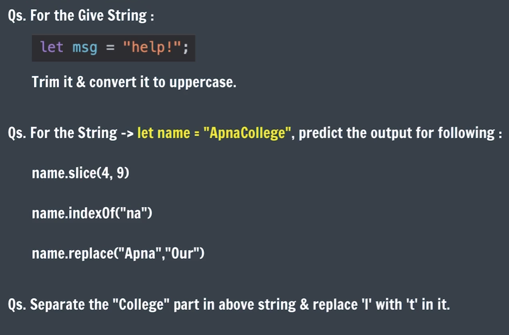
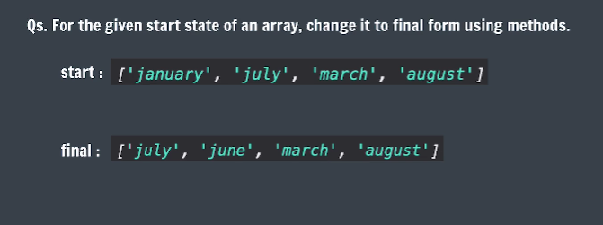
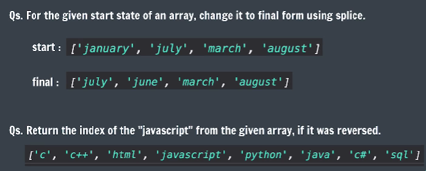
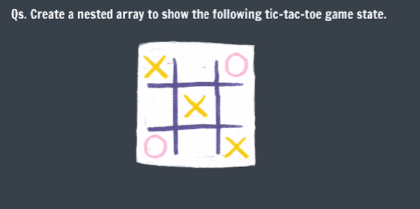

## Practice Questions

- **Qs 1 - 3**.  
    

- **Qs 4**.  
    

- **Qs 5 & 6**.  
    

- **Qs 7**.  
    

- **Qs 8**. Write a JavaScript program to get the first n elements of an array. [n can be any positive number].  
    For example: for array [7,9,0,-2] and n=3 Print, [7,9,0]

- **Qs 9**. Write a JavaScript program to get the last n elements of an array. [n can be any positive number].  
    For example: for array [7,9,0,-2] and n=3 Print, [9,0,-2]

- **Qs 10**. Write a JavaScript program to check whether a string is blank or not.

- **Qs 11**. Write a JavaScript program to test whether the character at the given (character) index is lowercase.

- **Qs 12**. Write a JavaScript program to strip leading and trailing spaces from a string.

- **Qs 13**. Write a JavaScript program to check if an element exists in an array or not.