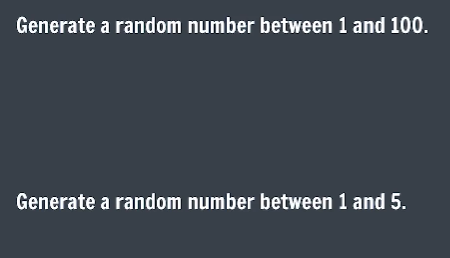

## Practice Questions

- **Qs 1**.  
    

- **Qs 2**. Create a program that generates a random number representing a dice roll. [The number should be between 1 and 6].

- **Qs 3**. Create an object representing a car that stores the following properties for the car: name, model, color.  
Print the car’s name.

- **Qs 4**. Create an object Person with their name, age and city. 
Edit their city’s original value to change it to “New York”. 
Add a new property country and set it to the United States.